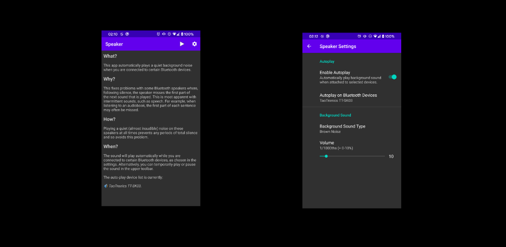

# Speaker - Bluetooth Background Sound

_Background sound while connected to specific Bluetooth devices._

## What?

This Android app automatically plays a quiet background noise when connected to specific Bluetooth devices.

## Why?

This fixes problems with some Bluetooth speakers where, following silence, the speaker misses the first part of the next sound that is played.  This is most apparent with intermittent sounds, such as speech.  For example, when listening to an audiobook, the first part of each sentence may often be missed.

## How?

Playing a quiet (almost inaudible) noise on these speakers at all times prevents any periods of total silence and so avoids this problem.

## When?

The sound will play automatically while you are connected to certain Bluetooth devices, as chosen in the settings.  Alternatively, you can temporarily play or pause the sound in the upper toolbar.

## See also

* [App Website](https://speaker.danjackson.dev)
* [Install directly from APK](https://github.com/danielgjackson/speaker/releases)
<!-- * [Open Source Code Repository](https://github.com/danielgjackson/speaker/) ([license](https://github.com/danielgjackson/speaker/blob/master/LICENSE)) -->
<!-- * [Privacy Policy](https://speaker.danjackson.dev/privacy.html) -->

<!--
Releases:

* Update versionCode in: `app/build.gradle`
* Update versionName in: `app/build.gradle`
* Add `metadata/en-US/changelogs/$versionCode.txt`
* Build signed APK, rename to: speaker-$versionName.apk
* Create release with APK attached named: $versionName
* Build signed AAB
* Create new release on Google Play Console
-->
